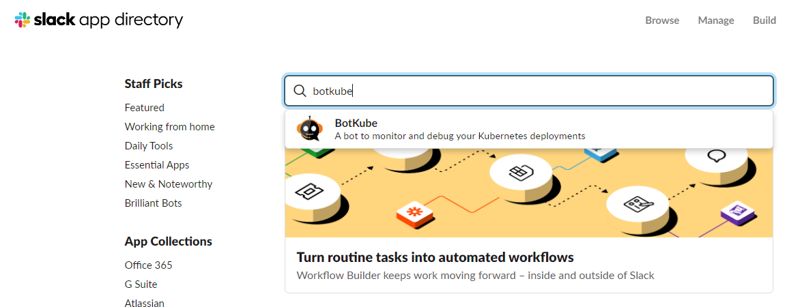
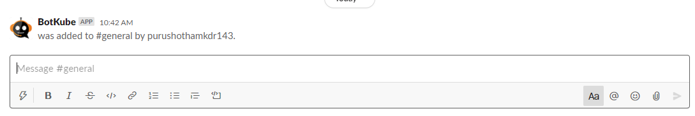
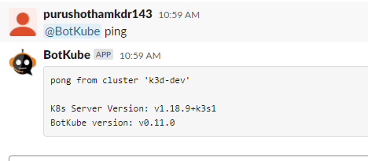
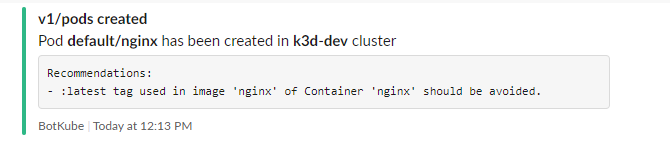
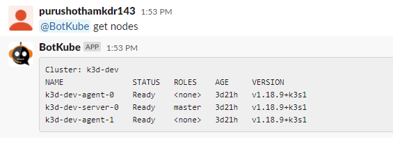

# BotKube - messaging bot for monitoring and debugging Kubernetes clusters

- [Botkube](#botkube)
   - [Overview](#overview)
   - [Pre-requisities](#pre-requisities)
   - [Supported Notification Channels](#supported-notification-channels)
   - [Installation](#installation)
	- [Install BotKube to the Slack workspace](#install-botKube-to-the-slack-workspace)
	- [Install BotKube Backend in Kubernetes cluster](#install-botKube-backend-in-kubernetes-cluster)
	- [Changing the Default configuration](#changing-the-default-configuration)
	- [Usage](#usage)
	    - [Checking whether botkube is sending notifications to slack channel](#checking-whether-botkube-is-sending-notifications-to-slack-channel)
		- [Executing kubectl commands from slack channel](#executing-kubectl-commands-from-slack-channel)
		- [Disabling And Enabling botkube notifications](#disabling-and-enabling-botkube-notifications)


### Botkube

### Overview

BotKube is a messaging bot for monitoring and debugging Kubernetes clusters. It's built and maintained with by InfraCloud.

**features**

- **Privacy** -> The backend for the BotKube app runs in your Kubernetes cluster - thus you have complete control on your data and software.  
- **Execute kubectl commands** -> Same old Kubectl syntax - just a new interface. You do not have to learn anything new! Plus you can configure which Kubectl commands BotKube can executes.  
- **Supports Custom Resources** -> BotKube can monitor literally any Kubernetes resource including Custom Resource. This enables you to configure alerts on some interesting events like - certificate issue/expiry if you are using cert-manager or backup failure in case you are using backup tools like Velero or Kanister.  
- **Open source** -> BotKube backend is open source.  
- **Security** -> By default BotKube uses a READONLY service account, you can customize this to your needs.  
- **Easy to configure** -> Get notifications about things that you really care for. You can configure events or objects or namespaces that you want to be informed about.  
- **Deploy on any Kubernetes cluster** -> You can deploy BotKube backend on any Kubernetes cluster, whether it is Minikube or cloud managed Kubernetes or anything in between.  


### Pre-requisities

- kubernetes cluster
- helm

**kubernetes cluster**
you can use any kubernetes cluster, if you want to quickly spin up kubernetes cluster then you can use k3d. commands to install k3d and install the kubernetes cluster using k3d as follows.

```
# k3d installation

wget -q -O - https://raw.githubusercontent.com/rancher/k3d/main/install.sh | bash

# verify the version of installed k3d
k3d --version

# cluster creation

k3d cluster create dev --agents 2

# check the kubernetes cluster
kubectl get nodes
```

**helm installation**

```
# Installing Helm on linux
wget https://get.helm.sh/helm-v3.4.1-linux-amd64.tar.gz
tar -xzvf helm-v3.4.1-linux-amd64.tar.gz
chmod +x ./linux-amd64/helm
mv ./linux-amd64/helm /usr/bin
```

### Supported Notification Channels

BotKube can be integrated with multiple messaging platforms. list is below.

- Slack  
- Mattermost  
- Microsoft Teams  
- ElasticSearch  
- OutgoingWebhook  

### Installation

BotKube has two components that need to be installed.

- BotKube App Integration in your Slack/Mattermost/Microsoft Teams  
- BotKube backend for the App in your Kubernetes cluster

Lets take a step by step on integrating with Slack.

#### Install BotKube to the Slack workspace

Navigate to https://\<your-slack-workspace\>.slack.com/apps. In the search bar enter "BotKube". Select that and Add it to your slack workspace and provide all permissions. new token gets created, save it we need it for later. Screenshot below for reference.



**Note**: Replace \<your-slack-workspace\> with "your slack workspace name".

Now let us add the "BotKube" to slack channel(to which you want to receive notifications)

you can invite the "botkube" bot to your channel by running the below command in the messaging area and click submit.

```
/invite @botkube
```

Now "botkube" is added to your channel. Screenshot below for reference.



#### Install BotKube Backend in Kubernetes cluster

Now we need to install botkube backend in kubernetes cluster. This can be done in 2 ways.

- using helm  
- using kubectl  

**Note**: if you would like to monitor multiple clusters, then botkube backend should be installed in each cluster.

Let us use Helm to install botkube backend.

**Adding helm repo**

```
helm repo add infracloudio https://infracloudio.github.io/charts
helm repo update
```

**deploying botkube backend**

```
kubectl create namespace botkube
helm install --version v0.11.0 botkube --namespace botkube \
  --set communications.slack.enabled=true \
  --set communications.slack.channel=<SLACK_CHANNEL_NAME> \
  --set communications.slack.token=<SLACK_API_TOKEN_FOR_THE_BOT> \
  --set config.settings.clustername=<CLUSTER_NAME> \
  --set config.settings.kubectl.enabled=<ALLOW_KUBECTL> \
  --set image.repository=infracloudio/botkube \
  --set image.tag=v0.11.0 \
  infracloudio/botkube
```

**Note**:

- SLACK_CHANNEL_NAME is the channel name where @BotKube is added  
- SLACK_API_TOKEN_FOR_THE_BOT is the Token you received after installing BotKube app to your Slack workspace  
- CLUSTER_NAME is the cluster name set in the incoming messages  
- ALLOW_KUBECTL set true to allow kubectl command execution by BotKube on the cluster  

With the default configuration, BotKube will watch all the resources in all the namespaces for create, delete and error events.

Lets test whether botkube is running and responding. Go the channel where botkube is added run the below command. Screenshot below for reference.

```
@Botkube ping
```



### Changing the Default configuration

As mentioned earlier with the default configuration, BotKube will watch all the resources in all the namespaces for create, delete and error events. however this can be changed. There are 2 methods to change the default configuration.

- using configmap update(Not Recommended)
- using helm upgrade 

**using configmap**

```
kubectl edit configmap botkube-configmap -n botkube
```

This command will open up a editor in which you can customize, which resources you want to monitor, in which namespaces, which events for those resources(for example delete,create,all etc).

**Note**: using this method is not recommended, this restarts the botkube pod.

**using helm upgrade**

create config.yml and copy the content below.

```
  config:
    ## Resources you want to watch
    resources:
    - name: v1/pods        # Name of the resource. Resource name must be in 
                           # group/version/resource (G/V/R) format
                           # resource name should be plural
                           # (e.g apps/v1/deployments, v1/pods)
      namespaces:          # List of namespaces, "all" will watch all the namespaces
        include:
        - all
        ignore:            # List of namespaces to be ignored, used only with include: all
        - kube-system      # example : include [all], ignore [x,y,z]
      events:              # List of lifecycle events you want to receive,
                           # e.g create, update, delete, error OR all
      - create
      - delete
      - error
    - name: batch/v1/jobs
      namespaces:
        include:
        - ns1
        - ns2
      events:
      - create
      - update
      - delete
      - error
      updateSetting:
        includeDiff: true
        fields:
        - spec.template.spec.containers[*].image
        - status.conditions[*].type
    ```
  - Pass the yaml file as a flag to `helm install` command.
    e.g

```

**Note**: Above mentioned config.yml file sample for just reference. Customize it according to your requirement(resource to monitor, in which namespaces, events etc)

Lets upgrade the helm release.
```
helm upgrade --version v0.11.0 --name botkube --namespace botkube -f config.yaml
```

### Usage
#### Checking whether botkube is sending notifications to slack channel

create a nginx pod to check whether botkube is sending notifications.

```
kubectl create -f [nginx-pod-with-out-annotation.yml](nginx-pod-with-out-annotation.yml)
```
You would receive a notification about pod creation to slack channel. screenshot below from reference.



If you dont want to receive notifications, then you can add annotations to pod spec as follows.

```
annotations:
    botkube.io/disable: "true"
```

```
kubectl create -f [nginx-pod-with-annotation.yml](nginx-pod-with-annotation.yml)
```

#### Executing kubectl commands from slack channel

you can execute the kubectl commands from slack channel.

For example

```
@BotKube get nodes
```
Screenshot below for reference.



**Note** kubectl prefix is not required while running commands as shown above.

You can get botkube help commands by running the below command.

```
/botkubehelp
```

#### Disabling And Enabling botkube notifications

you can view,disable,enable botkube notifications. Commands are as follows


**View botkube notification config**
```
@BotKube notifier showconfig
```

**botkube notification status**
```
@BotKube notifier status
```

**disabling botkube notification**
```
@BotKube notifier stop
```
**enabling botkube notification**
```
@BotKube notifier start
```

