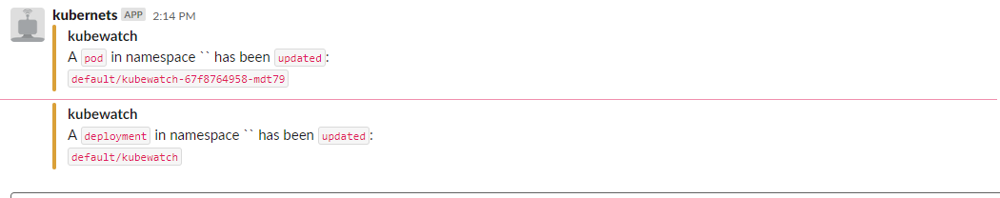

# Kubewatch integration with slack

- [kubewatch](#kubewatch)
   - [Overview](#overview)
   - [Supported Notification Channels](#Supported-Notification-Channels)
   - [Pre-requisities](#pre-requisites)
   - [Installation](#installation)
   - [Testing](#testing)

#### kubewatch

#### overview

`kubewatch` is a Kubernetes watcher that currently publishes notification to available collaboration hubs/notification channels. Run it in your k8s cluster, and you will get event notifications through webhooks.

#### Supported Notification Channels

Following are the supported channels by kubewatch.

- slack
- hipchat
- mattermost
- flock
- webhook
- smtp

#### Pre-requisities

- helm
- kubernetes cluster
- Slack Bot token creation & adding to channel

**helm installation**

```
wget https://get.helm.sh/helm-v3.4.1-linux-amd64.tar.gz
tar -xzvf helm-v3.4.1-linux-amd64.tar.gz
chmod +x ./linux-amd64/helm
mv ./linux-amd64/helm /usr/bin
```

**kubernetes cluster**

you can use any kubernetes cluster, if you want to quickly spin up kubernetes cluster then you can use k3d. commands to install k3d and install the kubernetes cluster using k3d as follows.

```
# k3d installation

wget -q -O - https://raw.githubusercontent.com/rancher/k3d/main/install.sh | bash

# verify the version of installed k3d
k3d --version

# cluster creation

k3d cluster create dev --agents 2

# check the kubernetes cluster
kubectl get nodes
```

**Slack Bot token creation & adding to channel**

Now login into this url https://\<slack-workspace\>/apps using your slack credentials.

in the search bar enter "Bots" Select the option which says "**Connect a bot to the Slack Real time messaging API**" -> click "Add Slack" -> Enter the username for your bot -> Click "Bot Integration" -> Save Configuration.

After following the above steps your will get a bot token that start with "xoxb". Make a note of it.

Now add the bot to the channel(to which you want notifications about kubernetes).

Go to your channel, in the message area type as follows. Click "Submit".

```
/invite @<bot username>
```

**Note**: Replace \<bot username\> with your bot name.

Now bot has been added to your slack channel.

#### Installation

kubewatch can be installed in multiple ways. we are going to install using helm.

**Other installation methods**

- kubectl
- docker
- go

create a file values.yml and copy the content below. Replace the channel to "your channel name" and also replace token with the bot token created above.

**Note**: values.yml file contains the resources(k8s resources) you want to monitor and slack details. If you want to monitor a resouce you can turn on the setting by changing to "true".

```
rbac:
  create: true
resourcesToWatch:
  deployment: true
  replicationcontroller: false
  replicaset: false
  daemonset: false
  services: true
  pod: true
  job: false
  node: false
  clusterrole: true
  serviceaccount: true
  persistentvolume: false
  namespace: false
  secret: false
  configmap: false
  ingress: false
slack:
  channel: '#YOUR_CHANNEL'
  token: 'xoxb-YOUR_TOKEN'
```

**installing kubewatch**

```
helm repo add bitnami https://charts.bitnami.com/bitnami
helm install kubewatch bitnami/kubewatch --values=values.yml
```

you can verify whether the kubewatch is running or not by running the below command.

```
kubectl --namespace=default get pods -l "app=kubewatch,release=kubewatch"
```

#### Testing

Lets create pod by running the below command.

```
kubectl run nginx --image nginx
```
	
After running the above command you should receive the notification. screenshot below for reference.





